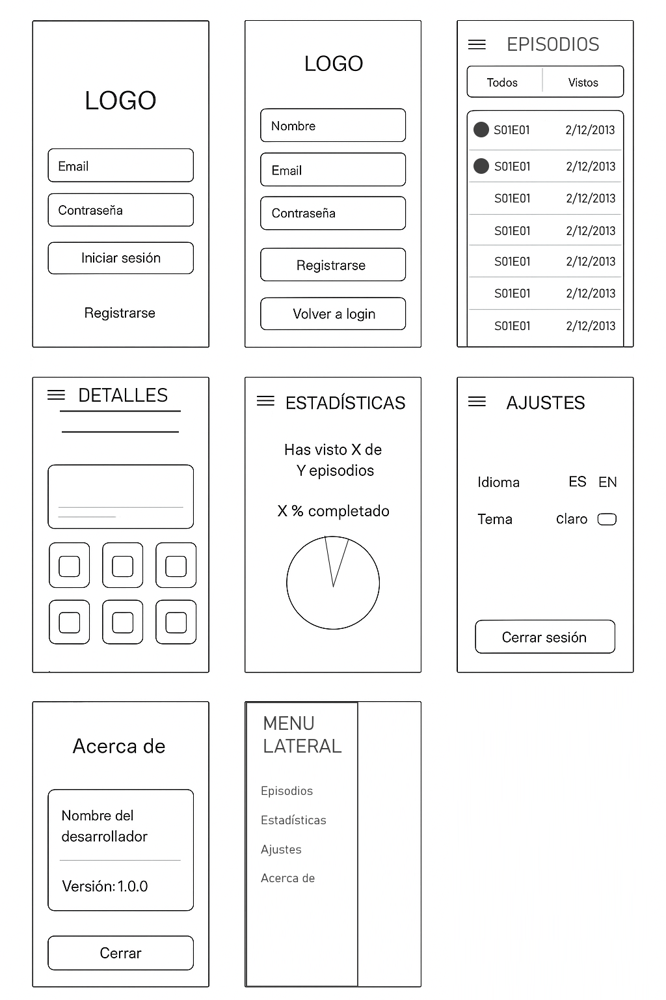

# 🛸 Tarea 3: Aplicación Android de Rick y Morty 🧪
**BK Programación** | Proyecto desarrollado por: **Irene Condado Alcantarilla**

Aplicación móvil nativa para Android desarrollada en **Kotlin** como caso práctico de entrenamiento para **BK Programación**. La aplicación permite a los usuarios gestionar y hacer un seguimiento de los episodios vistos de la serie *Rick and Morty*, integrando servicios en la nube para persistencia de datos y consumiendo una API REST externa.

A continuación se detalla la guía visual de referencia para el diseño de la aplicación (`img0.png`):



---

## 🏢 Caso Práctico & Contexto

Ada, jefa de BK Programación, ha planteado este proyecto para que los desarrolladores junior (Juan y María) dominen la integración de servicios en la nube de Firebase, la persistencia local y el consumo de APIs públicas. Aprovechando el fanatismo del equipo por *Rick and Morty*, la app se conecta a la API oficial de la serie para listar episodios y guardar el progreso personalizado de cada usuario en la nube de forma segura.

---

## ✨ Características Principales

### 📌 Apartado A & E: Interfaz de Usuario e Interacción
* **Flujo de Acceso:** Pantallas de *Login* y *Registro* independientes mediante `Activities`.
* **Arquitectura de Navegación:** Menú lateral dinámico (`NavigationDrawer`) gestionado con un `NavHostFragment` para intercambiar los siguientes fragmentos principales:
  * 🎬 **Episodios:** Catálogo con un `RecyclerView` que muestra el nombre del episodio, su código (`SxxExx`) y la fecha de emisión.
  * 📊 **Estadísticas:** Métricas de visualización (detalladas en el apartado F).
  * ⚙️ **Ajustes:** Configuración persistente (detallada en el apartado A).
  * ℹ️ **Acerca de:** Diálogo emergente (`AlertDialog`) que muestra el nombre del alumno y la versión (v1.0.0).
* **Filtros Avanzados en Toolbar:** Control dinámico para conmutar la lista entre *Todos los episodios* y *Sólo vistos*. Los episodios ya visualizados cuentan con una distinción gráfica (cambio de opacidad/color de fondo).
* **Detalle del Episodio:** Al pulsar sobre un ítem se despliega una vista detallada con:
  * Encabezado y metadatos del episodio.
  * Control interactivo (`Switch` / `ToggleButton`) para marcar o desmarcar el episodio como visto con sincronización en la nube.
  * Cuadrícula (`GridLayout`) que renderiza las imágenes y nombres de los personajes que aparecen en dicho capítulo.
* **Persistencia Local (Ajustes):** Uso de `SharedPreferences` para almacenar de forma persistente:
  * Cambio de idioma (Castellano ↔ Inglés).
  * Cambio de tema visual (Modo Claro ↔ Modo Oscuro).
  * Cierre de sesión seguro de Firebase.

### 📌 Apartado B: Autenticación con Firebase
* Registro e inicio de sesión seguro mediante correo electrónico y contraseña gestionado por **Firebase Authentication**.
* *(Opcional)* Soporte para Login rápido utilizando la cuenta de Google.

### 📌 Apartado C: Almacenamiento en la Nube con Cloud Firestore
* Base de datos NoSQL donde se almacena de forma independiente una colección por usuario con los episodios marcados como vistos.
* Cada documento de episodio en la base de datos almacena: `name`, `episode`, `air_date`, la lista de `characters` y el flag booleano `viewed`.

### 📌 Apartado D: Petición GET a la API
* Consumo asíncrono y mapeo de los datos mediante **Retrofit** apuntando a la URL base oficial: `https://rickandmortyapi.com/api/`.
* Carga perezosa de los personajes: cuando el usuario abre el detalle de un episodio, se procesan las URLs devueltas por la API para descargar en lote la información e imágenes de los personajes correspondientes.

### 📌 Apartado F: Estadísticas de Visualización
* Panel interactivo accesible desde el menú lateral.
* **Métricas:** Contadores numéricos dinámicos ("Has visto X de Y episodios") y cálculo exacto del porcentaje completado ("X% completado").
* **Visualización:** Gráfica circular/barra integrada para contrastar visualmente los episodios vistos frente a los totales.

### 📌 Apartado H: Funcionalidad Opcional (Selección Múltiple) *(+1 Punto)*
* Modo de selección múltiple integrado en el `RecyclerView` principal mediante una pulsación larga (*Long Click*).
* Permite seleccionar varios episodios simultáneamente y ejecutar una acción masiva para marcarlos todos como vistos de un solo golpe, actualizando instantáneamente Firestore y la UI.

---

## 🎨 Estilo Visual Sugerido

La interfaz gráfica sigue estrictamente las directrices del manual de marca de la serie, garantizando un alto contraste y accesibilidad:
* 🌌 **Azul Oscuro (`#0B1E2D`):** Fondo principal y barras de navegación.
* 🧪 **Verde Neón (`#00FF9C`):** Elementos de acento, botones activos e indicadores de estado "Visto".
* ⚡ **Amarillo (`#FFEB3B`):** Destacados, alertas y títulos secundarios.

---

## 🛠️ Tecnologías Utilizadas

* **Lenguaje:** [Kotlin](https://kotlinlang.org/)
* **Entorno:** Android Studio (Ladybug / Jellyfish o superior)
* **Arquitectura de red:** [Retrofit 2](https://square.github.io/retrofit/) & OkHttp para el consumo de la API REST.
* **Backend como Servicio (BaaS):** * [Firebase Authentication](https://firebase.google.com/docs/auth) (Gestión de sesiones).
  * [Firebase Cloud Firestore](https://firebase.google.com/docs/firestore) (Base de datos en tiempo real en la nube).
* **Componentes de UI:** `RecyclerView`, `NavigationDrawer`, `CardView`, `NavHostFragment`.
* **Carga de Imágenes:** [Glide](https://github.com/bumptech/glide) / [Coil](https://github.com/coil-kt/coil) para procesar las URLs de los personajes.
* **Gráficas:** [MPAndroidChart](https://github.com/PhilJay/MPAndroidChart) para el renderizado del gráfico de estadísticas.
* **Persistencia Local:** `SharedPreferences`.

---

## 🚀 Instrucciones de Uso y Configuración

### 1. Clonar el repositorio
```bash
git clone [https://github.com/tu-usuario/rick-and-morty-tracker.git](https://github.com/tu-usuario/rick-and-morty-tracker.git)
cd rick-and-morty-tracker
```

---

*Desarrollado como parte del módulo de Programación de Multimedia y Dispositivos Móviles (PMDM).*

